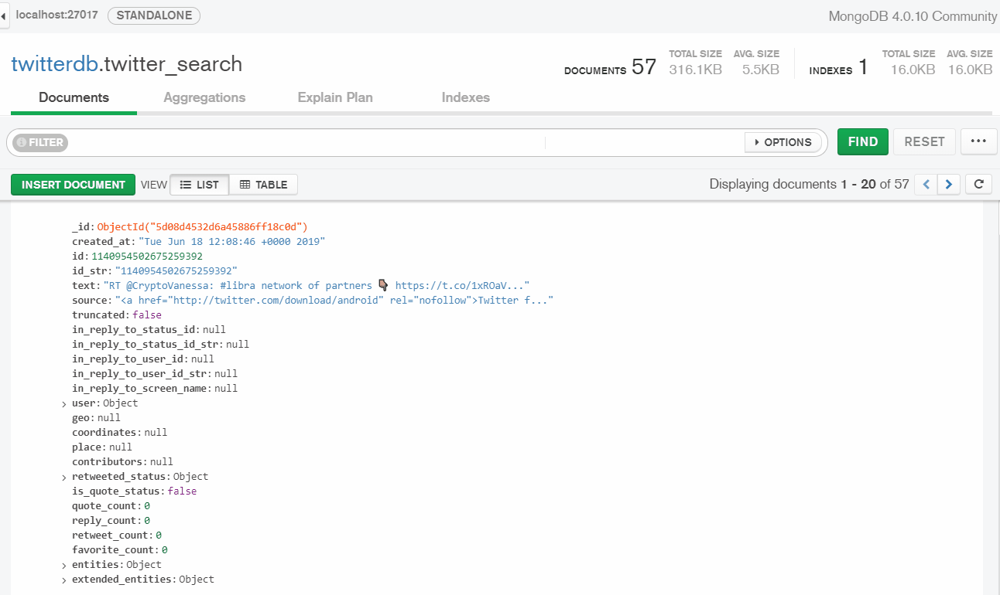

# tweetstream
A streaming engine for live fetching tweets and store them into a MongoDB database.

------------- 
**Tweetstream** is a light and functional solution for parsing Tweets in real time and storing them in a local MongoDB collection.

An easy-to-use starting point to implement different analysis routines including sentiment analysis, textual analysis and other parsing methods.

I.e.: the app can collect and store tweets based on a group of tickers ('#ADBE', '#NVDA', '#ORCL').


Requirements:
------------- 
- tweepy
- pymongo
- The Twitter Streaming API keys
- MongoDB installed locally

Editing
-------
The code can be used as-it-is, just edit it with your Twitter Streaming API keys:

```bash
CONSUMER_KEY = "your consumer key"
CONSUMER_SECRET = "your consumer secret"
ACCESS_TOKEN = "your access token"
ACCESS_TOKEN_SECRET = "your access token secret"
```

Point it to your local MongoDB:

```bash
MONGO_HOST= 'mongodb://localhost:XXXXX/twitterdb'
```

And edit the 'WORDS' list with your hashtags of interest:
```bash
WORDS = ['#EU','#Italy','#Germany']
```


Launch
------------- 

 Simply launch it via prompt and start collecting tweets in real-time:
 ```bash
 $ python tweetstream.py
 ```
 
In the following example we are tracking ***Libra***, Facebook's new cryptocurrency:


The stream is on and Tweets are stored in our database collection:


